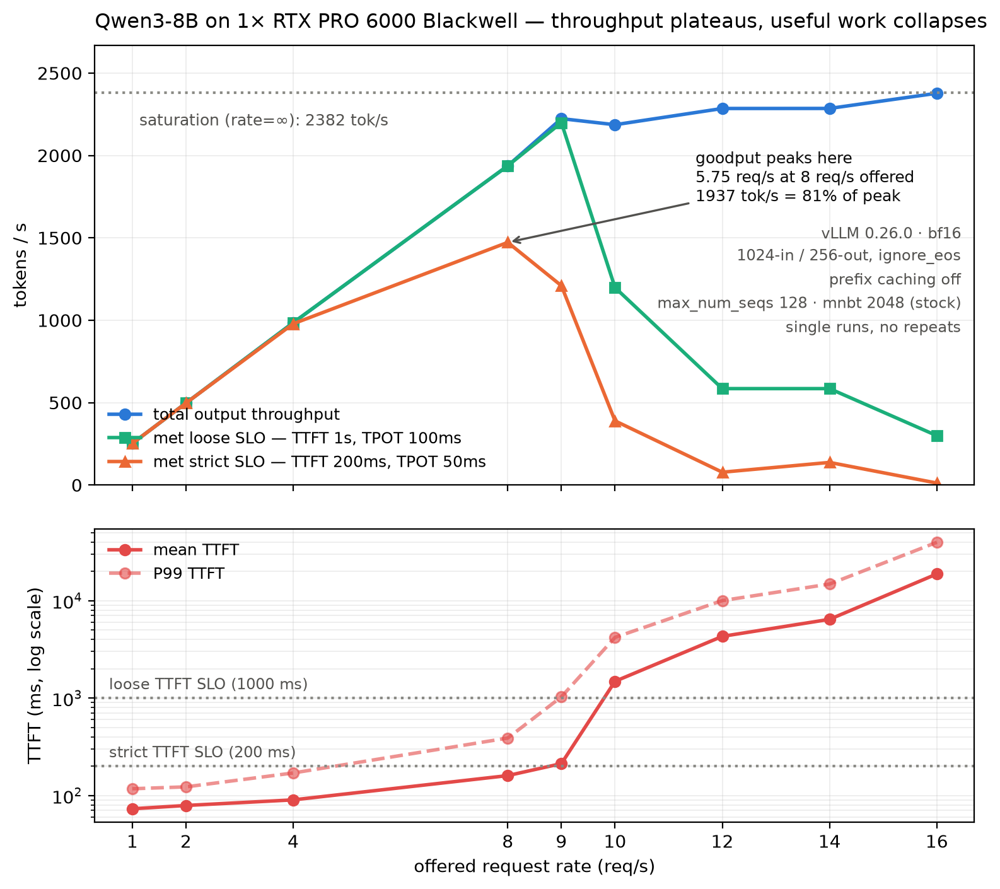

# serving_experiments

A public log of LLM inference/serving experiments on a single Blackwell GPU.

Each week states **a question and its predictions before measuring anything**, then publishes the
result — including the predictions that turned out wrong. The write-ups are not edited afterwards to
look smarter. Every number here is reproducible from the committed data.

## Hardware

- 1× NVIDIA RTX PRO 6000 Blackwell, 96 GB (sm_120), driver 595.84 / CUDA 13.2
- 24 cores, 60 GB system RAM
- Single GPU, so: no tensor parallelism, no multi-node, no disaggregated prefill/decode
- No CUDA toolkit installed — which silently routes vLLM's FP8 GEMM to a Cutlass fallback. That's
  week 2's subject.

---

## Week 1 — throughput vs goodput

**Question:** how far apart are peak output throughput and the request rate actually servable at an
interactive SLO?



| | |
|---|---|
| Peak output throughput | **2382 tok/s** (saturation) |
| Servable at TTFT ≤ 200 ms, TPOT ≤ 50 ms | **5.75 req/s**, at 1937 tok/s — 81% of peak |
| Servable at TTFT ≤ 1 s, TPOT ≤ 100 ms | **8.59 req/s** — +49% from the SLO definition alone |
| Completed-request capacity | ~9 req/s, flat above it |

The last 19% of throughput costs 99% of the goodput. And goodput is not a property of the server —
it's a property of the server *and* the latency bar you chose.

Setup: Qwen3-8B bf16, vLLM 0.26.0, 1024-in/256-out with `ignore_eos`, prefix caching off,
`max_num_seqs=128` and `max_num_batched_tokens=2048` (both stock defaults, deliberately untuned).
11 request rates from 1 to saturation. SM clocks held 2745–2760 MHz throughout, so no thermal
throttling. Full detail and the pre-registered predictions: **[`week1/week1.md`](week1/week1.md)**.

### Two predictions that were wrong

Kept because they're the useful part:

- The goodput peak was predicted near 16 req/s. It landed at **8** — the capacity wall is lower than
  guessed, and the collapse is a queueing phase transition at ρ≈1 rather than gradual degradation.
- `--max-model-len` was assumed to reserve KV per sequence. It doesn't; V1 allocates blocks on
  demand, so steady-state usage is identical at 4096 and 262144.

One prediction held sharply: TPOT at low load was predicted at 9–12 ms from weights ÷ memory
bandwidth alone, and measured **11.68 ms**.

---

## Verifying the numbers yourself

`week1/upload_result/summary.json` holds **per-request TTFT and TPOT for all 11 runs** — which is
exactly what an SLO threshold evaluates. So you can recompute goodput at whatever bar you care about
without re-running anything:

> a request counts if `ttft_ms <= your TTFT bound` and `tpot_ms <= your TPOT bound`;
> goodput = count ÷ `duration`

`plot.py` does this and cross-checks the strict tier against vLLM's own `request_goodput`, recorded
at run time. They agree to **0.00000 req/s** across all 11 runs.

## Layout

```
week1/
  week1.md                  question + predictions (pre-registered), setup, results, daily notes
  notes/
    napkin-model.md         first-principles cost model used to predict each run before measuring
    tpot-vs-itl.md          why median ITL < median TPOT is not a contradiction
  src/
    serve.sh                the vLLM server, every flag pinned
    benchmark.sh            the 11 runs, with per-run clock capture; re-runnable, skips completed
    slim.py                 49 MB of raw output -> 136 KB committable summary
    plot.py                 summary -> the chart
  upload_result/            committed artifacts
    summary.json            per-request TTFT/TPOT, all 11 runs
    week1_goodput.png       the chart
    server_start.txt        startup log: KV cache size, resolved flags
    warmup_bench.txt        the discarded warmup run; calibrates the cost model
    clocks.csv              SM clock / temp / power before and after every run
  results/                  gitignored: raw vLLM output, 49 MB, regenerable
week2.md                    next week's question, not yet run
CLAUDE.md                   working agreement and standing methodology
```

## Reproducing

Redraw the chart from committed data — no GPU needed:

```bash
uv sync
uv run python week1/src/plot.py
```

Re-run the measurements (needs the GPU; ~30 min):

```bash
bash week1/src/serve.sh              # terminal 1, leave running
bash week1/src/benchmark.sh          # terminal 2, 11 runs
uv run python week1/src/slim.py      # results/ -> upload_result/summary.json
uv run python week1/src/plot.py
```

## What this is not

- **Not a GPU comparison.** One card, measured under stated flags. Nothing here says anything about
  H100s.
- **Not a tuned configuration.** Scheduler defaults were pinned and left alone on purpose, so the
  baseline is reproducible. Tuning is a separate experiment.
- **Not statistically robust.** Single runs, no repeats. The rate-12 vs rate-14 goodput wobble is
  variance at near-zero goodput, not an effect. Repeats are next.
- **One workload shape.** 1024-in/256-out with fixed output length. Real traffic has variable
  lengths, which changes TPOT's meaning — see [`week1/notes/tpot-vs-itl.md`](week1/notes/tpot-vs-itl.md).
